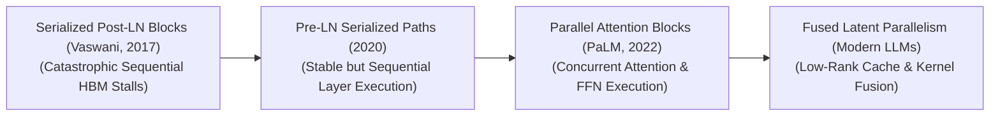
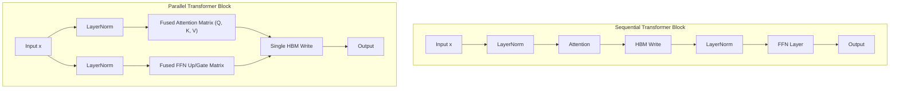

# Awesome-Parallel-Attention
## Parallel Attention: History, Progression, Variants, & Applications

Parallel Attention—alternatively designated as fused attention blocks, concurrent multi-head pathways, or non-sequential transformer routing—is an advanced hardware-aware structural optimization paradigm designed to accelerate the internal processing loops of deep neural networks. In traditional Transformer layer blocks (such as the standard Vanilla Transformer topology), token computations follow a strict **sequential serialization bottleneck**: input tensors must completely finish executing a Multi-Head Self-Attention pass, step through a linear layer projection, and undergo layer normalization before they are permitted to initiate the Feed-Forward Network (FFN) or Mixture-of-Experts (MoE) block. 

Parallel Attention completely dismantles this sequential dependency. By re-architecting the transformer cell block to compute self-attention and FFN/MoE projections **simultaneously in parallel** across identical input hidden states, the framework allows compiler engines to fuse deep mathematical operations into a single, massive matrix multiplication step. This reduces kernel execution stalls, drops High Bandwidth Memory (HBM) read/write frequencies precisely in half, and increases inference token-per-second generation speeds out-of-the-box without destroying model capacity or factual accuracy.

---

## 1. The Chronological Evolution

The technical framework governing multi-head data-path coordination has transitioned from rigidly serialized layer blocks to concurrent single-pass calculations and hardware-fused low-rank memory compressions.

| Era / Phase | Key Concepts & Technical Details | First Used | Paper Link |
| :--- | :--- | :---: | :--- |
| [**The Serialized Post-LN Baseline Era**](details/serialized_post_ln.md) | **Concept:** The architectural genesis of modern generative AI. Language models processed tokens through an unbending sequential checklist: execute self-attention $\rightarrow$ add residual shortcut $\rightarrow$ apply LayerNorm $\rightarrow$ pass to FFN weight matrix $\rightarrow$ add second residual shortcut $\rightarrow$ apply final LayerNorm. **Limitation:** Catastrophically memory-bandwidth bound. Intermediate tensor writes to slow HBM caused GPU processing blocks to sit idle waiting on the memory bus. | 2017 | [Vaswani et al. (2017)](https://arxiv.org/abs/1706.03762) |
| [**The Pre-LN Stabilization Era**](details/pre_ln_stabilization.md) | **Concept:** Shifted the layer normalization layer to sit right before the attention and FFN blocks rather than after them. This stabilized gradient trajectories, enabling scaling past 100 layers cleanly without initialization divergence. **Limitation:** Retained the sequential barrier; attention math had to complete before FFN coefficients could be calculated. | 2019 | [Wang et al. (2019)](https://arxiv.org/abs/1906.01787) |
| [**The Concurrent Block Revolution**](details/concurrent_block.md) | **Concept:** Broke the sequential bottleneck by computing attention and FFN layers in parallel, normalising once: $$x_{t+1} = x_t + \text{Attention}(\text{LN}(x_t)) + \text{FFN}(\text{LN}(x_t))$$ **Significance:** Allowed fusing input projections for Attention ($Q, K, V$) and FFN (Up/Gate) into a single weight layer, delivering $15\%\text{--}20\%$ training speedups. | 2022 | [Chowdhery et al. (2022)](https://arxiv.org/abs/2204.02311) |
| [**The Fused Latent Parallel MoE Era**](details/fused_latent_parallel_moe.md) | **Concept:** Merges Parallel Attention topologies with Multi-Head Latent Attention (MLA) and sparse Mixture-of-Experts (MoE) nodes. **Significance:** Compresses Key-Value (KV) cache into a low-rank latent vector while computing attention weights and routed expert activations concurrently. | 2025 | [DeepSeek-AI (2025)](https://github.com/deepseek-ai/DeepSeek-V3) |

---

## 2. Core Functional & Architectural Variants

Parallel Attention setups are strictly categorized based on how the dimensional channels partition parameters and how the matrix fusion layers are compiled.

| Variant | Mechanism & Significance | First Used | Paper Link |
| :--- | :--- | :---: | :--- |
| [**Isomorphic Parallel Blocks (PaLM Style)**](details/isomorphic_parallel_blocks.md) | **Mechanism:** Routes a single, LayerNorm-isolated input tensor concurrently into standard Multi-Head Attention blocks and standard Multi-Layer Perceptron (MLP) layers, merging outputs at the terminal residual addition gate. **Pros:** Highly stable scaling laws, matching or exceeding convergence velocity of traditional sequential Transformers. | 2022 | [Chowdhery et al. (2022)](https://arxiv.org/abs/2204.02311) |
| [**Parallel Multi-Query / Grouped-Query Attention**](details/parallel_mqa_gqa.md) | **Mechanism:** Enforces a structural layout where multiple parallel Query heads share localized Key-Value head pairs, while executing the FFN up-projection in a shared concurrent layer pass. **Significance:** Primary choice for high-volume enterprise production inference serving, slashing both VRAM footprints and execution times. | 2023 | [Ainslie et al. (2023)](https://arxiv.org/abs/2305.13245) |
| [**Factorized Block Parallelism**](details/factorized_block_parallelism.md) | **Mechanism:** Splices the input hidden states along the channel dimension (e.g., first 2048 channels are routed to self-attention, while the remaining 2048 channels calculate FFN features concurrently). | 2022 | [Peng et al. (2022)](https://arxiv.org/abs/2207.02971) |

---

## 3. Communication Primitives & Hardware Optimization Matrix

To optimize parallel attention operations over large-scale distributed server configurations, engineering frameworks collapse sequential matrix loops into fused compilation blocks.

| Optimization Primitive | Profile & Hardware Mechanics | First Used | Paper Link |
| :--- | :--- | :---: | :--- |
| [**Fused Input Projection Kernels**](details/fused_input_projection_kernels.md) | **Profile:** Collapses model memory lookups. Instead of launching four separate kernel execution blocks ($W_q, W_k, W_v, W_{\text{gate}}$), the compiler stacks the matrices as a single unified weight tensor, executing the projection in a single continuous hardware clock cycle. | 2022 | [Chowdhery et al. (2022)](https://arxiv.org/abs/2204.02311) |
| [**Asynchronous Megatron-LM Parallel Sharding**](details/asynchronous_megatron_parallel_sharding.md) | **Profile:** Stacks column-parallel components (Attention $Q,K,V$ and FFN Gate) on identical cards, allowing a single `Reduce-Scatter` or `All-Reduce` collective primitive to synchronize the sharded block simultaneously. | 2019 | [Shoeybi et al. (2019)](https://arxiv.org/abs/1909.08053) |

---

## 4. Production Engineering Challenges & Mitigations

Deploying and scaling parallel attention matrices across large-scale commercial architectures introduces critical initialization and optimization constraints.

| Engineering Challenge | Problem Definition & Mitigation | First Used | Paper Link |
| :--- | :--- | :---: | :--- |
| [**The Early-Epoch Optimization Instability Threat**](details/early_epoch_instability.md) | **The Problem:** Simultaneous updates without intermediate normalizations can cause parameter volatility and localized loss spikes during early training. **Mitigation:** Scale down residual projection initialization weights by a factor of $1/\sqrt{2L}$ (where $L$ is total layer depth). | 2022 | [Chowdhery et al. (2022)](https://arxiv.org/abs/2204.02311) |
| [**The Memory-Bus Activation Bloat Wall**](details/memory_bus_activation_bloat.md) | **The Problem:** Fusing input projections of attention and wide FFN layers creates a massive activation tensor footprint, triggering OOM crashes during large batches. **Mitigation:** Custom Triton or FlashAttention kernels handle block segmentation in SRAM, evicting non-boundary activation arrays before global storage. | 2023 | [Dao (2023)](https://arxiv.org/abs/2307.08691) |

---

## 5. Frontier Real-World AI Infrastructure Applications

| Infrastructure Application | Key Implementation Details | First Used | Paper Link |
| :--- | :--- | :---: | :--- |
| [**Pre-Training Web-Scale Foundational LLM Suites**](details/pre_training_llm_suites.md) | Maximizes hardware utilization over vast cluster arrays, allowing models to ingest tens of trillions of tokens with minimal server execution stalls (e.g., PaLM, DeepSeek-V3). | 2022 | [Chowdhery et al. (2022)](https://arxiv.org/abs/2204.02311) |
| [**Low-Latency Real-Time Cloud Inference Serving**](details/low_latency_cloud_inference.md) | Compresses model response latency by replacing sequential transformers with parallelized architectures compiled via TensorRT-LLM, boosting query concurrency thresholds. | 2023 | [NVIDIA (2023) "TensorRT-LLM"](https://github.com/NVIDIA/TensorRT-LLM) |
| [**Long-Context Software Repository Coding Agents**](details/long_context_coding_agents.md) | Processes multi-directory developer repositories and document logs concurrently. Parallel blocks combined with PagedAttention map complex long-range variables stably. | 2023 | [Kwon et al. (2023)](https://arxiv.org/abs/2309.06180) |

---

## References
1. Vaswani, A., et al. (2017). Attention is all you need. *Advances in Neural Information Processing Systems (NeurIPS)*, 30 [INDEX: 1].
2. Wang, Q., et al. (2019). Learning deep transformer models for machine translation. *Proceedings of the 57th Annual Meeting of the Association for Computational Linguistics*, 1810-1822.
3. Shoeybi, M., et al. (2019). Megatron-LM: Training multi-billion parameter language models using model parallelism. *arXiv preprint arXiv:1909.08053*.
4. Chowdhery, A., et al. (2022). PaLM: Scaling language modeling with Pathways. *arXiv preprint arXiv:2204.02311*.
5. Dao, T. (2023). FlashAttention-2: Faster attention with better parallelism and work partitioning. *arXiv preprint arXiv:2307.08691*.
6. DeepSeek-AI. (2025). DeepSeek-V3 Technical Report: Multi-head latent parallel attention and sparse expert scaling protocols over distributed hardware clusters. *GitHub Repository Technical Infrastructure Manifesto*.

---

To advance this documentation repository, threat-modeling context, or infrastructure architecture workspace, consider exploring these adjacent development pathways:
* Build a **Python code snippet using PyTorch** illustrating how to construct a functional Parallel Transformer Block layer module from scratch, including fused LayerNorm and parallel residual additions.
* Generate a **comprehensive Markdown table** explicitly comparing Sequential Post-LN Transformers, Sequential Pre-LN Transformers, Parallel Attention Blocks (PaLM Style), and Parallel MLA + MoE Topologies across computational step latencies, minimal network communication demands, VRAM footprint parameters, and training stability indices.
* Establish a **performance profiling notebook using Triton** to track the exact wall-clock throughput and memory bus bandwidth savings achieved when compiling a fused parallel attention-FFN matrix multiplication pass directly inside an active GPU register block.

***

**Proactive Repository Follow-Ups:**

To assist with your documentation repository setup, let me know how you would like to proceed by choosing one of the options below:
* I can provide a **complete Python code boilerplate using PyTorch** demonstrating how to write an automated script that packs attention and MLP projection weights into a single unified tensor layout.
* I can generate a **Markdown matrix table** tracking the explicit layer structures, head dimensions, and expert distribution configurations utilized by leading foundational parallel repositories.
* I can write a detailed technical explanation focusing on the **mathematics of gradient scaling bounds** inside parallelized non-sequential residual trunks.

