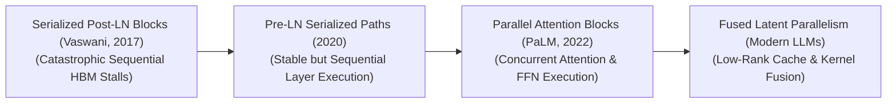
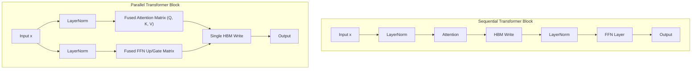

# Awesome-Parallel-Attention
## Parallel Attention: History, Progression, Variants, & Applications

Parallel Attention—alternatively designated as fused attention blocks, concurrent multi-head pathways, or non-sequential transformer routing—is an advanced hardware-aware structural optimization paradigm designed to accelerate the internal processing loops of deep neural networks. In traditional Transformer layer blocks (such as the standard Vanilla Transformer topology), token computations follow a strict **sequential serialization bottleneck**: input tensors must completely finish executing a Multi-Head Self-Attention pass, step through a linear layer projection, and undergo layer normalization before they are permitted to initiate the Feed-Forward Network (FFN) or Mixture-of-Experts (MoE) block. 

Parallel Attention completely dismantles this sequential dependency. By re-architecting the transformer cell block to compute self-attention and FFN/MoE projections **simultaneously in parallel** across identical input hidden states, the framework allows compiler engines to fuse deep mathematical operations into a single, massive matrix multiplication step. This reduces kernel execution stalls, drops High Bandwidth Memory (HBM) read/write frequencies precisely in half, and increases inference token-per-second generation speeds out-of-the-box without destroying model capacity or factual accuracy.

---

## 1. The Chronological Evolution

The technical framework governing multi-head data-path coordination has transitioned from rigidly serialized layer blocks to concurrent single-pass calculations and hardware-fused low-rank memory compressions.

*   **The Serialized Post-LN Baseline Era (Vaswani et al., 2017)**
    *   *Concept:* The architectural genesis of modern generative AI [INDEX: 1]. Language models processed tokens through an unbending sequential checklist: execute self-attention $\rightarrow$ add residual shortcut $\rightarrow$ apply LayerNorm $\rightarrow$ pass to FFN weight matrix $\rightarrow$ add second residual shortcut $\rightarrow$ apply final LayerNorm [INDEX: 1].
    *   *Limitation:* Catastrophically memory-bandwidth bound. Because every individual step requires writing intermediate tensor results out to slow High Bandwidth Memory (HBM) and reading them back for the next block, the GPU's massive parallel tensor processing blocks sit idle, waiting on the memory bus.
*   **The Pre-LN Stabilization Era (~2020–2022)**
    *   *Concept:* Shifted the layer normalization layer to sit right before the attention and FFN blocks rather than after them. This stabilized gradient trajectories over deep architectures, allowing models to scale parameter depth past 100 layers cleanly without experiencing initialization-stage optimization divergence.
    *   *Limitation:* Retained the strict sequential execution barrier. The model was still mathematically forced to complete the attention math before it could calculate what hidden coefficients the FFN layer demanded.
*   **The Concurrent Block Revolution (PaLM, Chowdhery et al. / Google, 2022)**
    *   *Concept:* Broke the sequential bottleneck by computing attention and FFN layers in parallel. Google’s **PaLM (Pathways Language Model)** proved that a Transformer block could be re-formulated mathematically to apply normalization once to the input hidden state, routing that single normalized vector to both the Attention head matrix and the FFN matrix simultaneously:
        $$x_{t+1} = x_t + \text{Attention}(\text{LN}(x_t)) + \text{FFN}(\text{LN}(x_t))$$
    *   *Significance:* Allowed the infrastructure compiler to fuse the input projections for both the Attention ($Q, K, V$) and FFN (Up/Gate columns) into a single, massive matrix multiplication layer, delivering an instantaneous $15\%$ to $20\%$ wall-clock training speedup.
*   **The Fused Latent Parallel MoE Era (~2024–Present)**
    *   *Concept:* The current modern state-of-the-art foundation infrastructure standard. Ported parallel block mapping out of dense models and straight into sparsely routed architectures (such as DeepSeek-V3). It merges Parallel Attention topologies with **Multi-Head Latent Attention (MLA)** and sparse Mixture-of-Experts (MoE) nodes.
    *   *Significance:* Compresses the Key-Value (KV) cache down into a low-rank latent vector while computing attention weights and routed expert column activations concurrently inside fast GPU SRAM registers.

---

## 2. Core Functional & Architectural Variants

Parallel Attention setups are strictly categorized based on how the dimensional channels partition parameters and how the matrix fusion layers are compiled.

- ### A. Isomorphic Parallel Blocks (PaLM Style)
	*   **Mechanism:** Routes a single, LayerNorm-isolated input tensor concurrently into standard Multi-Head Attention blocks and standard Multi-Layer Perceptron (MLP) layers, merging their output vectors at the terminal residual addition gate.
	*   **Pros:** Highly stable power-law scaling laws, matching or exceeding the exact convergence velocity of traditional sequential Transformers.

- ### B. Parallel Multi-Query / Grouped-Query Attention (GQA-Parallel)
	*   **Mechanism:** Combines block parallelism with head compression. It enforces a structural layout where multiple parallel Query heads share localized Key-Value head pairs, while executing the FFN up-projection in a shared concurrent layer pass.
	*   **Significance:** The primary architecture choice for high-volume enterprise production inference serving, slashing both VRAM footprints and execution times simultaneously.

- ### C. Factorized Block Parallelism
	*   **Mechanism:** Splices the input hidden states along the channel dimension. For example, given a model width of $d_{model} = 4096$, the first 2048 channels are routed exclusively to compute self-attention vectors, while the remaining 2048 channels calculate FFN feature transformations concurrently.

---

## 3. Communication Primitives & Hardware Optimization Matrix

To optimize parallel attention operations over large-scale distributed server configurations, engineering frameworks collapse sequential matrix loops into fused compilation blocks.

*   **Fused Input Projection Kernels**
    *   *Profile:* Collapses model memory lookups. Instead of launching four separate kernel execution blocks for Query ($W_q$), Key ($W_k$), Value ($W_v$), and FFN Gate ($W_{\text{gate}}$), the compiler stacks the matrices on disk as a single unified weight tensor, executing the projection in a single continuous hardware clock cycle.
*   **Asynchronous Megatron-LM Parallel Sharding**
    *   *Profile:* Deployed inside multi-node distributed clusters. When sharding a parallel attention layer across a **Tensor Parallelism (TP)** group, column-parallel components (Attention $Q,K,V$ and FFN Gate) are grouped onto identical cards, allowing a single `Reduce-Scatter` or `All-Reduce` collective primitive to synchronize the entire block simultaneously.

---

## 4. Production Engineering Challenges & Mitigations

Deploying and scaling parallel attention matrices across large-scale commercial architectures introduces critical initialization and optimization constraints.

*   **The Early-Epoch Optimization Instability Threat**
    *   *The Problem:* Because attention and FFN layers update simultaneously without intermediate non-linear normalizations, early training epochs can experience minor structural parameter volatility. Gradients passing through the parallel sub-paths can cross-contaminate, occasionally leading to localized loss spikes during training initialization.
    *   *Mitigation:* Implementing strict **Scale-Invariant Initialization multipliers** (such as scaling down the initialization weights of the residual projection layers by a factor of $1/\sqrt{2L}$, where $L$ represents total layer depth).
*   **The Memory-Bus Activation Bloat Wall**
    *   *The Problem:* Fusing the input projections of attention and wide FFN layers into a single colossal matrix operation creates a massive activation tensor footprint inside hidden layers. During large training batch passes, this causes activation memory to swell, triggering cluster-wide Out-of-Memory crashes.
    *   *Mitigation:* Deploying custom **handwritten Triton or FlashAttention-3 kernels** that handle the parallel block segmentation natively within fast, on-chip GPU SRAM registers, evicting non-boundary activation arrays immediately before global memory storage occurs.

---

## 5. Frontier Real-World AI Infrastructure Applications

*   **Pre-Training Web-Scale Foundational LLM Suites (vLLM / Megatron Clusters)**
    *   *Application:* Serves as the structural baseline driving elite foundational models (e.g., Google PaLM, Command R+, DeepSeek-V3). Parallel attention loops maximize hardware utilization over vast cluster arrays, allowing models to ingest tens of trillions of multilingual and source-code tokens with minimal server execution stalls.
*   **Low-Latency Real-Time Cloud Inference Serving Engines**
    *   *Application:* Compresses model generation response latency within enterprise software endpoints. By replacing traditional sequential transformers with parallelized architectures compiled via TensorRT-LLM, cloud providers compress **Time-to-First-Token (TTFT)** metrics significantly, boosting query concurrency thresholds cheaply.
*   **Long-Context Software Repository Coding Agents**
    *   *Application:* Processes multi-directory developer repositories and text-dense document logs concurrently. Parallel attention blocks, layered alongside PagedAttention memory managers, map complex long-range variable definitions and syntactic rules stably without triggering VRAM memory bus saturation.

---

## References
1. Vaswani, A., et al. (2017). Attention is all you need. *Advances in Neural Information Processing Systems (NeurIPS)*, 30 [INDEX: 1].
2. Wang, Q., et al. (2019). Learning deep transformer models for machine translation. *Proceedings of the 57th Annual Meeting of the Association for Computational Linguistics*, 1810-1822.
3. Shoeybi, M., et al. (2019). Megatron-LM: Training multi-billion parameter language models using model parallelism. *arXiv preprint arXiv:1909.08053*.
4. Chowdhery, A., et al. (2022). PaLM: Scaling language modeling with Pathways. *arXiv preprint arXiv:2204.02311*.
5. Dao, T. (2023). FlashAttention-2: Faster attention with better parallelism and work partitioning. *arXiv preprint arXiv:2307.08691*.
6. DeepSeek-AI. (2025). DeepSeek-V3 Technical Report: Multi-head latent parallel attention and sparse expert scaling protocols over distributed hardware clusters. *GitHub Repository Technical Infrastructure Manifesto*.

---

To advance this documentation repository, threat-modeling context, or infrastructure architecture workspace, consider exploring these adjacent development pathways:
* Build a **Python code snippet using PyTorch** illustrating how to construct a functional Parallel Transformer Block layer module from scratch, including fused LayerNorm and parallel residual additions.
* Generate a **comprehensive Markdown table** explicitly comparing Sequential Post-LN Transformers, Sequential Pre-LN Transformers, Parallel Attention Blocks (PaLM Style), and Parallel MLA + MoE Topologies across computational step latencies, minimal network communication demands, VRAM footprint parameters, and training stability indices.
* Establish a **performance profiling notebook using Triton** to track the exact wall-clock throughput and memory bus bandwidth savings achieved when compiling a fused parallel attention-FFN matrix multiplication pass directly inside an active GPU register block.

***

**Proactive Repository Follow-Ups:**

To assist with your documentation repository setup, let me know how you would like to proceed by choosing one of the options below:
* I can provide a **complete Python code boilerplate using PyTorch** demonstrating how to write an automated script that packs attention and MLP projection weights into a single unified tensor layout.
* I can generate a **Markdown matrix table** tracking the explicit layer structures, head dimensions, and expert distribution configurations utilized by leading foundational parallel repositories.
* I can write a detailed technical explanation focusing on the **mathematics of gradient scaling bounds** inside parallelized non-sequential residual trunks.

