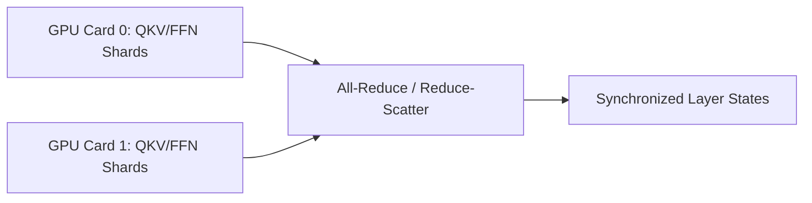

# 🌐 Asynchronous Megatron-LM Parallel Sharding

A distributed sharding mechanism designed for sharding parallel attention layers across Tensor Parallelism (TP) groups.

## 🚀 Concept & Architecture
By grouping column-parallel components on the same GPU cards, Megatron-LM enables parallel calculations and a single collective synchronization primitive.

## 📈 Significance
- Overlaps computation and communication phases.
- Scales model parameter sharding efficiently across multi-node hardware setups.

[↩️ Back to README](../README.md)
