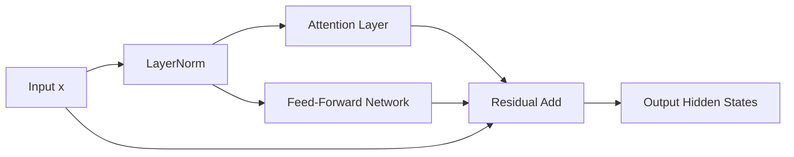

# ⚡ The Concurrent Block Revolution (PaLM Style)

Introduced by Google in the PaLM paper (Chowdhery et al., 2022), Parallel Attention computes Attention and FFN layers concurrently instead of sequentially.

## 🚀 Concept & Architecture
By normalising the input hidden state once, the same normalized representation is routed to both Attention and FFN blocks simultaneously.

## 📈 Significance
- **Operator Fusion:** Projections for Query, Key, Value, and FFN columns can be fused into a single huge matrix multiplication kernel.
- **Speedup:** Cuts HBM roundtrips in half, delivering $15\%\text{--}20\%$ training speedup.

[↩️ Back to README](../README.md)
