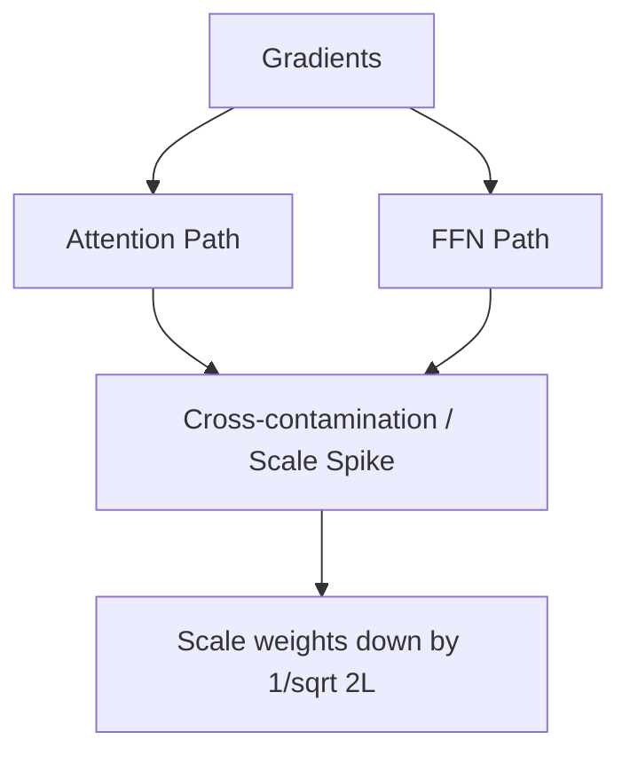

# ⚠️ Early-Epoch Optimization Instability Threat

Deploying parallel transformers introduces stability concerns during early pre-training stages.

## 🚀 Concept & Mitigation
Since attention and FFN updates are applied directly to the residual stream without intermediate normalizations, gradients can cross-contaminate. 

## 📈 Mitigation
We scale down the initialization weights of the residual projection layers by a factor of $1/\sqrt{2L}$ (where $L$ is the total layer depth) to ensure stable optimization bounds.

[↩️ Back to README](../README.md)
