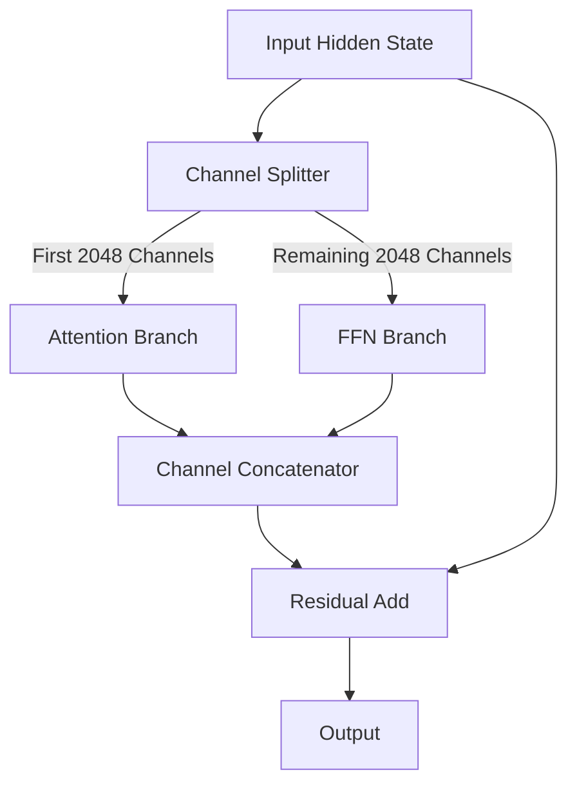

# ✂️ Factorized Block Parallelism

Factorized block parallelism splices the input hidden states along the channel dimension.

## 🚀 Concept & Architecture
Given a model width (e.g., $d_{model} = 4096$), channels are split (e.g., first 2048 to attention, and the rest to FFN/MLP).

## 📈 Significance
- Reduced FLOPs per layer.
- Retains representative capability across distinct parallel branches.

[↩️ Back to README](../README.md)
