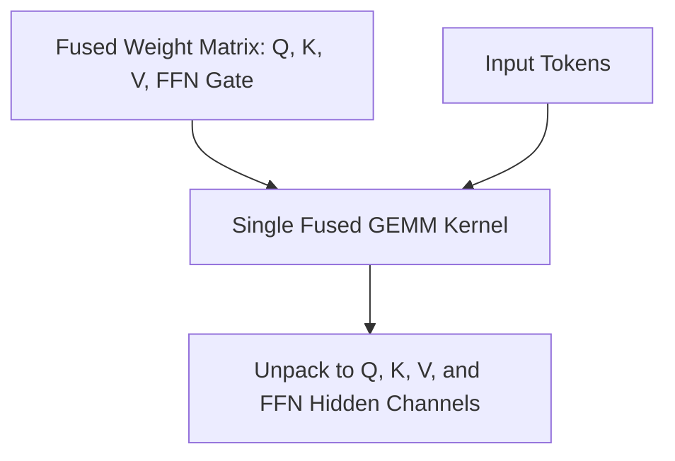

# 🎛️ Fused Input Projection Kernels

Fused kernels collapse model memory lookups by packing weights onto identical hardware registers.

## 🚀 Concept & Architecture
Instead of firing 4 separate kernels for $Q, K, V,$ and FFN projections, they are stacked as a single weight matrix.

## 📈 Significance
- Reduced memory latency on modern GPU tensor cores.
- Fuses multiple elementwise operations, preventing HBM read/write stalls.

[↩️ Back to README](../README.md)
