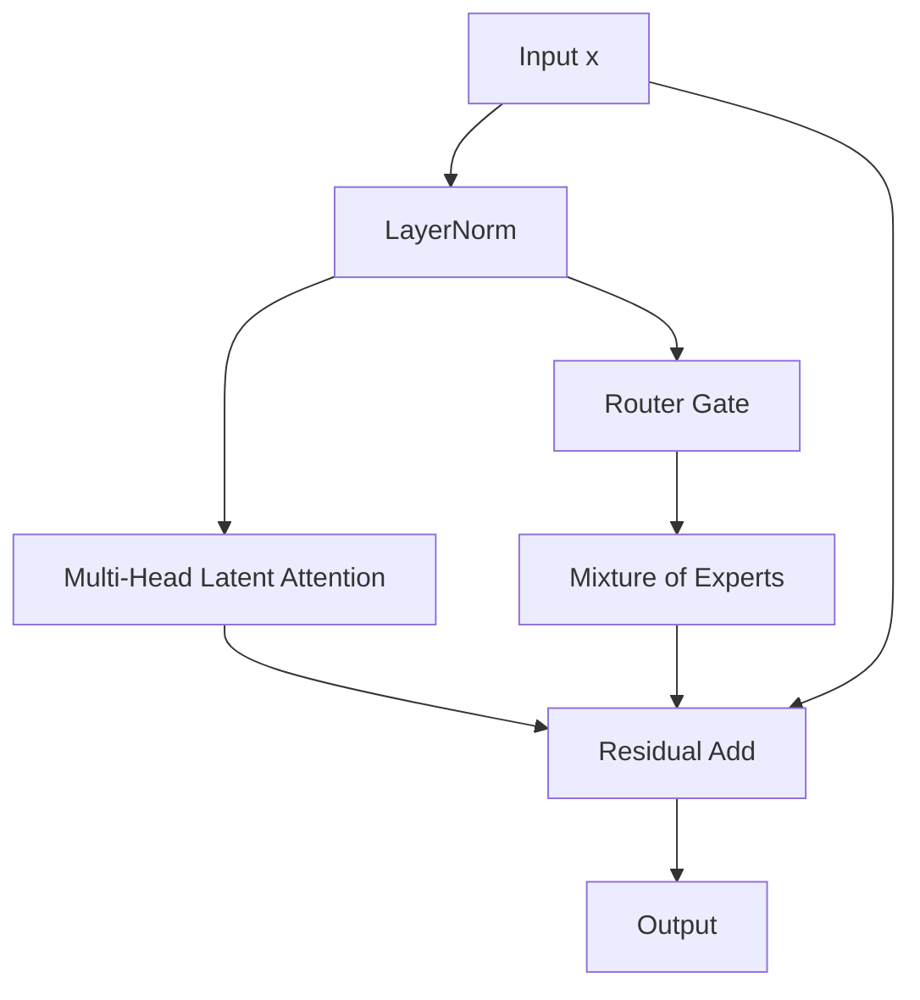

# 🌌 The Fused Latent Parallel MoE Era

Modern models like DeepSeek-V3 combine Parallel Attention paths with Multi-Head Latent Attention (MLA) and Mixture-of-Experts (MoE).

## 🚀 Concept & Architecture
By computing the routing gates and low-rank KV compression concurrently, models achieve massive scale with fast inference.

## 📈 Significance
- Extremely low VRAM memory footprint for KV Cache.
- Maximum utilization of tensor cores on modern hardware clusters.

[↩️ Back to README](../README.md)
