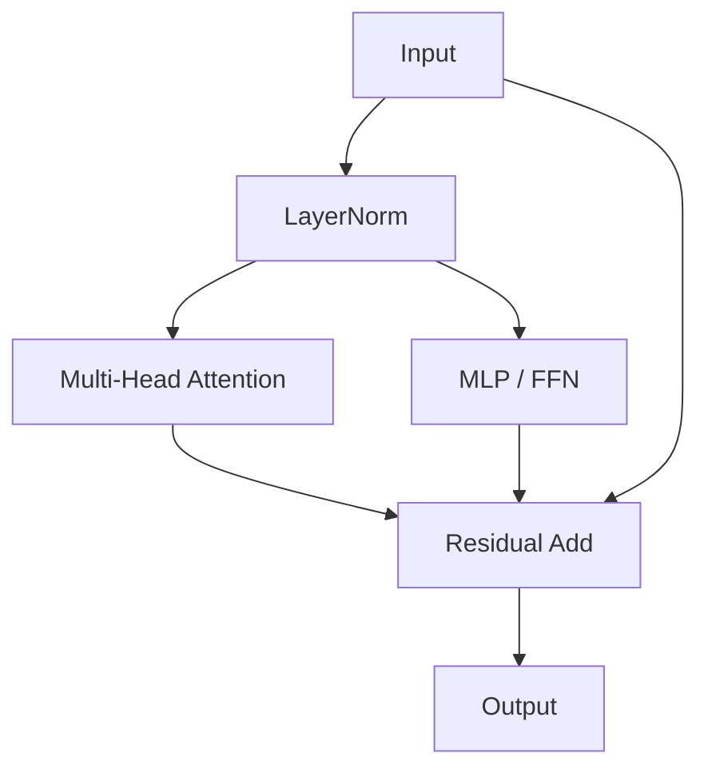

# 🔗 Isomorphic Parallel Blocks (PaLM Style)

Isomorphic parallel blocks are the structural baseline for modern parallel architectures.

## 🚀 Concept & Architecture
The standard formulation runs isomorphic (dimensionally identical) paths of Attention and MLP concurrently over a single normalized state.

## 📈 Pros
- Extremely robust convergence.
- Scale-invariant propagation dynamics.

[↩️ Back to README](../README.md)
