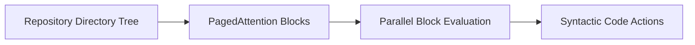

# 📂 Long-Context Software Repository Coding Agents

Coding agents require ingestion of massive context windows without triggering memory bus saturation.

## 🚀 Concept & Architecture
By layering parallel block architectures alongside PagedAttention memory layouts, models resolve long-range symbols without blowing up memory.

## 📈 Applications
- Autocomplete, codebase-wide search, and automated refactoring agents.
- Safely processes multiple directories of source-code tokens concurrently.

[↩️ Back to README](../README.md)
