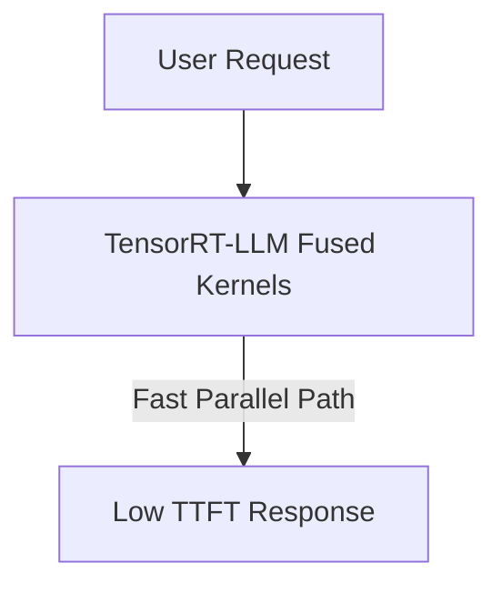

# ⚡ Low-Latency Real-Time Cloud Inference Serving Engines

Real-time serving engines leverage parallel architecture templates to minimize latency.

## 🚀 Concept & Workflow
By wrapping operations in TensorRT-LLM, parallel components are fused, boosting serving concurrency metrics cheaply.

## 📈 Applications
- Enterprise API endpoints (vLLM, TensorRT-LLM).
- Slashes Time-To-First-Token (TTFT) metrics in commercial generative products.

[↩️ Back to README](../README.md)
