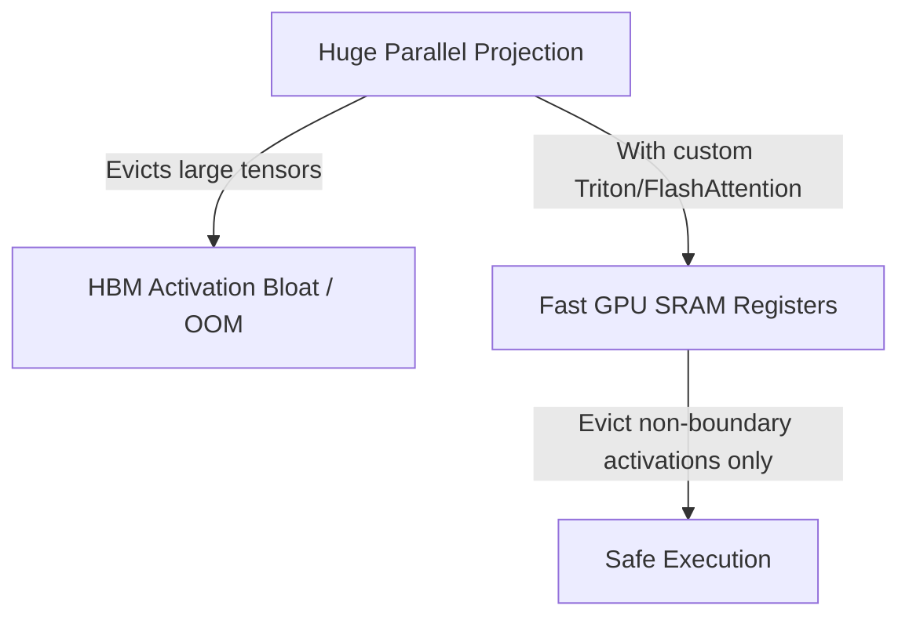

# 💾 The Memory-Bus Activation Bloat Wall

Fusing input projections creates huge activation footprints, which can lead to Out-Of-Memory (OOM) situations on GPU nodes.

## 🚀 Concept & Architecture
Custom kernels partition and manage operations entirely within SRAM, avoiding costly evictions back to global HBM.

## 📈 Mitigation
By leveraging handwritten Triton or FlashAttention-3 kernels, intermediate activations are computed and discarded inside fast SRAM registers, bypassing the activation storage bottleneck.

[↩️ Back to README](../README.md)
