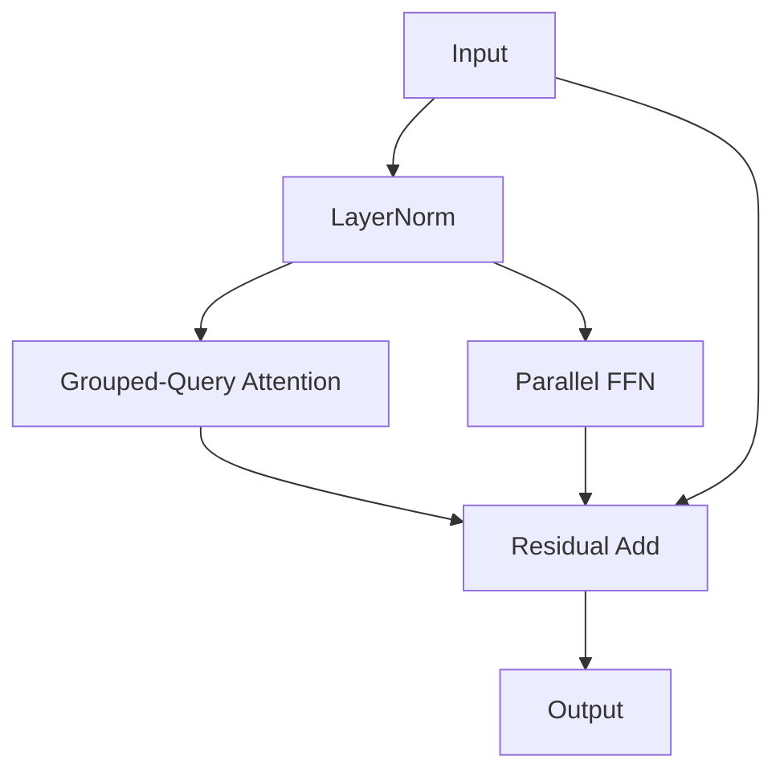

# ⚙️ Parallel Multi-Query / Grouped-Query Attention (GQA-Parallel)

This variant combines parallel block structures with head-dimension optimizations such as Multi-Query Attention (MQA) or Grouped-Query Attention (GQA).

## 🚀 Concept & Architecture
By sharing Key-Value heads among multiple Query heads, the attention projection matrices are dramatically shrunk, and computed concurrently with FFN up-projections.

## 📈 Significance
- Slashing of VRAM footprints during sequence generation.
- Highly optimized memory bandwidth bounds.

[↩️ Back to README](../README.md)
