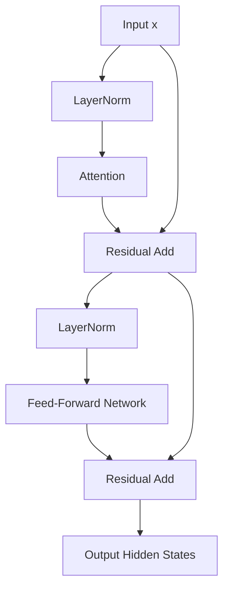

# ⚖️ Pre-LN Stabilization Era

The Pre-LN (Pre-Layer Normalization) stabilization paradigm emerged as the default design choice for training deep Transformer networks (~2020–2022).

## 🚀 Concept & Architecture
Pre-LN places the Layer Normalization *before* the sub-layers (Attention and FFN) rather than after the residual addition. This ensures a clean identity path along the residual stream.

## ⚠️ Limitations
- **Strict Serialization:** While it solves gradient instability (enabling scaling past 100 layers), execution remains strictly sequential. The FFN layer cannot start computing until the Attention layer completely finishes and its output is normalized.

[↩️ Back to README](../README.md)
