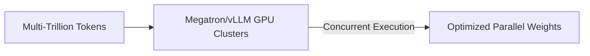

# 🏢 Pre-Training Web-Scale Foundational LLM Suites

Pre-training foundational LLM suites relies heavily on parallel attention structures to maximize training flops and cluster efficiency.

## 🚀 Concept & Workflow
Foundational clusters scale to thousands of GPUs. Parallel attention maximizes GPU computational block utilization by sharding columns efficiently.

## 📈 Applications
- Serves as the structural baseline for Google PaLM, Cohere Command R+, and DeepSeek-V3.
- Dramatically increases tokens-per-second training metrics.

[↩️ Back to README](../README.md)
