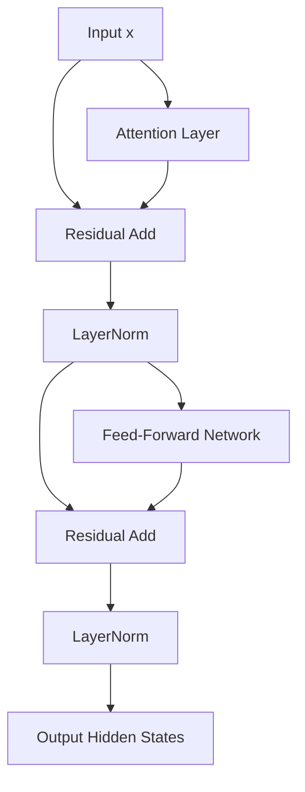

# 🔄 Serialized Post-LN Baseline Era

The Serialized Post-LN (Post-Layer Normalization) topology was the original structural paradigm introduced in the seminal Attention Is All You Need paper (Vaswani et al., 2017).

## 🚀 Concept & Architecture
In this baseline configuration, Layer Normalization (LN) is applied *after* the residual addition. 

## ⚠️ Limitations
- **HBM Read/Write Bottleneck:** Every sub-layer (Attention, LayerNorm, FFN) execution requires writing intermediate states back to the GPU High Bandwidth Memory (HBM) and reading them back for the subsequent operation.
- **Gradient Exploding/Vanishing:** Because normalizations are placed on the residual paths after addition, gradient propagation becomes unstable as depth increases, requiring strict learning rate warmups.

[↩️ Back to README](../README.md)
